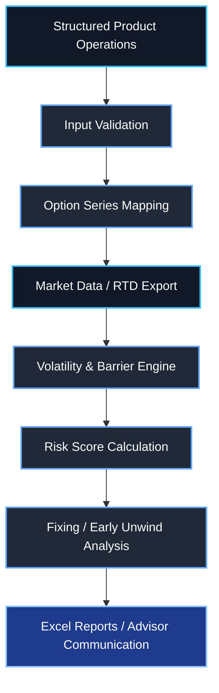
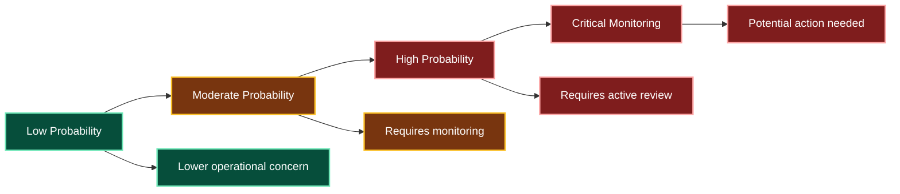
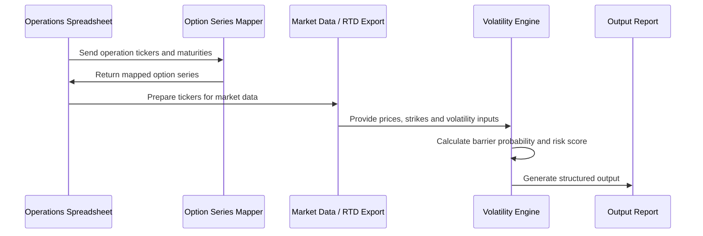
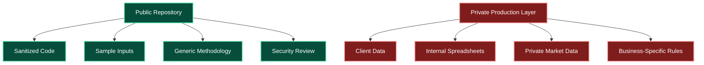

# Options Risk & Volatility Engine

<p align="left">
  
  
  
  
  
</p>

Public-safe version of an options risk and volatility engine built to support structured products analysis, barrier probability estimation, early unwind monitoring and fixing workflows.

The project demonstrates how Python can be used to connect financial market data, Excel-based workflows, option series mapping, implied volatility inputs and structured product rules into a practical decision-support tool for investment desks.

> This repository is a sanitized public version. It does not contain client data, private spreadsheets, real e-mails, internal paths, proprietary files, credentials or confidential business information.

---

## Overview

Structured products and options-based strategies require constant monitoring of market variables such as price, volatility, strike, maturity, barriers and payoff rules.

In manual workflows, this analysis can become slow, fragmented and error-prone, especially when operations depend on multiple Excel files, RTD feeds, option chains and product-specific conditions.

This project was created to automate and organize that process.

The core flow is:



---

## Problem

Options and structured products monitoring often involves several manual steps:

- Reading operation parameters from Excel;
- Mapping option tickers and maturities;
- Checking barriers and trigger levels;
- Estimating probability of barrier breach;
- Updating market data manually;
- Comparing current results against benchmarks;
- Identifying early unwind opportunities;
- Monitoring fixing dates;
- Sending information to advisors or internal teams.

This creates operational friction and increases the chance of errors in time-sensitive decisions.

---

## Solution

This repository organizes multiple automation modules into a single framework for options and structured products analysis.

The engine supports:

- Barrier probability estimation;
- Volatility-based risk scoring;
- Option series mapping using exchange files;
- RTD-based market data workflows;
- Structured product fixing calculations;
- Early unwind opportunity analysis;
- Excel report generation;
- Advisor-oriented operational outputs.

---

## Key Features

| Feature | Description |
|---|---|
| Barrier Probability Engine | Estimates the probability of a barrier being breached using volatility, maturity and market inputs. |
| Volatility Workflow | Uses implied volatility and option-chain information to support risk estimation. |
| Option Series Mapping | Maps option tickers to underlying assets, maturities and contract references. |
| RTD Integration Workflow | Supports workflows based on exported real-time data from Excel/RTD feeds. |
| Early Unwind Analysis | Identifies structured products with potential early exit opportunities. |
| Fixing Automation | Calculates outcomes for structured products reaching fixing date. |
| Excel-Based Outputs | Generates operational spreadsheets for monitoring and communication. |
| Public-Safe Design | Uses sanitized examples and removes sensitive business data. |

---

## Repository Structure

```text
options-risk-volatility-engine/
│
├── barrier_probability/
│   └── barrier_probability_engine.py
│
├── b3_series_mapping/
│   └── b3_option_series_mapper.py
│
├── structured_products_fixing/
│   └── structured_products_fixing.py
│
├── early_unwind_analysis/
│   └── early_unwind_analysis.py
│
├── legacy/
│   └── barrier_probability_engine_v7.py
│
├── docs/
│   ├── methodology.md
│   └── security_review.md
│
├── samples/
│   ├── sample_operations.csv
│   ├── sample_rtd_export.csv
│   └── README.md
│
├── .env.example
├── .gitignore
├── .gitattributes
├── requirements.txt
├── requirements-windows.txt
├── LICENSE
└── README.md
```

---

## Main Modules

### `barrier_probability/barrier_probability_engine.py`

Main risk engine for estimating barrier breach probability.

It reads operation parameters, option market data and volatility inputs to calculate a risk score related to barrier events.

Typical use cases:

- Down barrier monitoring;
- Knock-out / knock-in risk estimation;
- Structured product risk classification;
- Probability-based ranking of operations.

---

### `b3_series_mapping/b3_option_series_mapper.py`

Utility module for mapping option tickers, maturity dates and underlying assets.

It supports workflows where option series files are used to connect derivatives tickers with their corresponding underlying assets and expiration dates.

Typical use cases:

- Mapping option code to base ticker;
- Filtering option series by maturity;
- Preparing tickers for RTD or external quote sources;
- Reducing manual work in options data preparation.

---

### `structured_products_fixing/structured_products_fixing.py`

Automation module for structured products reaching fixing date.

It calculates the outcome of different structures based on product rules, underlying asset performance and fixing parameters.

Typical use cases:

- Monitoring products with fixing date today;
- Calculating final result by structure type;
- Preparing advisor-facing operational information;
- Reducing manual fixing checks.

---

### `early_unwind_analysis/early_unwind_analysis.py`

Module designed to identify early unwind opportunities.

It compares current structured product result, operation parameters and benchmark references to highlight operations that may deserve attention.

Typical use cases:

- Early exit monitoring;
- Profit opportunity screening;
- Structured products review;
- Advisor communication support.

---

### `legacy/barrier_probability_engine_v7.py`

Previous version of the barrier probability engine kept for historical reference.

This file is useful to show the evolution of the model and the transition between versions.

---

## Methodology

The project combines practical market workflows with quantitative approximations.

At a high level, the engine considers:

- Current underlying price;
- Barrier level;
- Time to maturity;
- Implied volatility;
- Option chain data;
- Strike distribution;
- Calendar days or business days;
- Product-specific rules;
- Structured payoff behavior.

The model is not intended to replace professional risk systems. It is a decision-support and operational automation tool designed to make risk monitoring faster, more organized and more auditable.

---

## Risk Scoring Concept

The output can be interpreted as a relative risk indicator.



Example interpretation:

| Score Range | Interpretation |
|---:|---|
| 0% - 25% | Low probability of barrier breach |
| 25% - 50% | Moderate risk |
| 50% - 75% | High risk |
| 75% - 100% | Critical monitoring zone |

---

## Example Workflow

A typical workflow can follow this structure:



---

## Input Examples

The public repository uses sample files only.

Example operation input:

| Operation ID | Underlying | Structure | Barrier | Maturity | Notional |
|---|---|---|---:|---|---:|
| OP-001 | ABCD3 | Knock-Out | 85.00 | 2026-12-18 | 100000 |
| OP-002 | XPTO4 | Smart Hedge | 72.50 | 2026-10-16 | 150000 |
| OP-003 | TEST11 | Fence | 95.00 | 2027-01-15 | 80000 |

Example RTD/market data input:

| Ticker | Spot | Strike | Maturity | Implied Volatility |
|---|---:|---:|---|---:|
| ABCD3 | 100.00 | 85.00 | 2026-12-18 | 28.5% |
| XPTO4 | 80.00 | 72.50 | 2026-10-16 | 31.2% |
| TEST11 | 105.00 | 95.00 | 2027-01-15 | 24.8% |

---

## Technologies Used

| Category | Technologies |
|---|---|
| Language | Python |
| Data Processing | Pandas, NumPy |
| Excel Automation | OpenPyXL |
| Optional Windows Automation | PyWin32 |
| Market Data Workflow | RTD / Excel export-oriented process |
| External Data | Public financial APIs where applicable |
| Reporting | Excel output files |
| Documentation | Markdown, Mermaid |

---

## Installation

Create a virtual environment:

```bash
python -m venv .venv
```

Activate it on Windows:

```bash
.venv\Scripts\activate
```

Install dependencies:

```bash
pip install -r requirements.txt
```

For Windows-specific automation modules:

```bash
pip install -r requirements-windows.txt
```

---

## Environment Variables

A safe example file is included:

```text
.env.example
```

Example configuration:

```env
APP_ENV=local
DATA_DIR=./samples
OUTPUT_DIR=./output
SEND_EMAILS=false
OPERATIONS_EMAIL=operations@example.com
```

Production credentials, private paths and internal e-mails must never be committed to the repository.

---

## Running the Modules

### Barrier Probability Engine

```bash
python barrier_probability/barrier_probability_engine.py
```

### Option Series Mapper

```bash
python b3_series_mapping/b3_option_series_mapper.py
```

### Structured Products Fixing

```bash
python structured_products_fixing/structured_products_fixing.py
```

### Early Unwind Analysis

```bash
python early_unwind_analysis/early_unwind_analysis.py
```

The public-safe version may require sample inputs or local configuration adjustments before execution.

---

## Business Impact

This type of automation can generate significant operational gains:

| Impact Area | Result |
|---|---|
| Risk Monitoring | Faster identification of operations close to risk triggers. |
| Operational Efficiency | Reduces manual analysis across multiple Excel files. |
| Decision Support | Creates objective scoring for structured products review. |
| Process Standardization | Applies consistent calculation logic across operations. |
| Advisor Support | Produces clearer outputs for advisor communication. |
| Auditability | Makes assumptions, inputs and outputs easier to review. |
| Scalability | Allows more operations to be monitored with less manual effort. |

---

## Public-Safe Scope

This repository focuses on the architecture and implementation pattern.

It intentionally excludes:

- Real client data;
- Internal spreadsheets;
- Production file paths;
- Real e-mails;
- Private report sources;
- Credentials;
- Proprietary pricing data;
- Confidential business rules.



---

## Limitations

This project is not a pricing library and does not replace a professional risk management system.

Important limitations:

- Outputs depend on input quality;
- Volatility assumptions can materially affect results;
- RTD/exported market data may be incomplete or stale;
- Barrier probability models are approximations;
- Product-specific payoff rules may require additional private logic;
- Public examples are simplified and sanitized.

---

## Status

Public-safe portfolio version.

The repository demonstrates the technical design and implementation approach without exposing confidential infrastructure, internal spreadsheets, client information or proprietary business data.

---

## Author

**Lucas Daniel de Oliveira Morandi**

Financial markets professional focused on automation, business intelligence, data workflows, derivatives monitoring and operational efficiency for investment-related processes.
